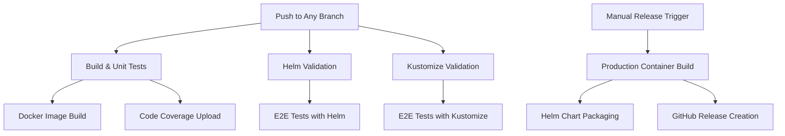

# Scality COSI Driver - Continuous Integration Documentation

This comprehensive guide covers the complete CI/CD infrastructure for the Scality COSI Driver project, including workflows, testing strategies, deployment processes, and maintenance procedures.

---

## Table of Contents

1. [Overview](#overview)
2. [CI Architecture](#ci-architecture)
3. [Workflow Details](#workflow-details)
4. [Testing Infrastructure](#testing-infrastructure)
5. [Code Quality & Coverage](#code-quality--coverage)
6. [Security & Compliance](#security--compliance)
7. [Troubleshooting](#troubleshooting)
8. [Maintenance & Monitoring](#maintenance--monitoring)
9. [Development Workflow](#development-workflow)

---

## Overview

The Scality COSI Driver uses **GitHub Actions** as its primary CI/CD platform, providing comprehensive automated testing, building, and deployment capabilities. The CI system is designed to ensure high code quality, comprehensive test coverage, and reliable deployments across multiple environments.

### Key Features

- **Multi-environment testing** across RING versions 9.4 and 9.5
- **Comprehensive test coverage** including unit, integration, and end-to-end tests
- **Automated security scanning** and dependency management
- **Multi-platform container builds** (AMD64/ARM64)
- **Automated releases** with Helm chart publishing
- **Code quality monitoring** with Codecov integration

---

## CI Architecture

### Workflow Structure



### Environment Matrix

The CI system tests against multiple Scality RING versions:

| Environment | RING Version | GitHub Variable | Purpose |
|-------------|--------------|-----------------|---------|
| Test Matrix 1 | 9.4 | `CLOUDSERVER_RING_9_4` | Legacy compatibility testing |
| Test Matrix 2 | 9.5 | `CLOUDSERVER_RING_9_5` | Current version testing |

---

## Workflow Details

### 1. Build & Unit Tests (`build-and-unit-tests.yml`)

**Triggers:** Push to any branch

**Purpose:** Validates code compilation, runs unit tests, and builds development containers.

#### Jobs

##### `unit-tests-with-ginkgo`
- **Runtime:** Ubuntu Latest
- **Go Version:** 1.23.2
- **Testing Framework:** Ginkgo v2 with Gomega

**Steps:**
1. **Code Checkout:** `actions/checkout@v4`
2. **Go Setup:** `actions/setup-go@v5`
3. **Ginkgo Installation:** `go install github.com/onsi/ginkgo/v2/ginkgo@latest`
4. **Dependency Management:** `go mod tidy`
5. **Test Execution:** `make test` (runs `ginkgo -r -v --cover --coverprofile=coverage.txt`)
6. **Coverage Upload:** `codecov/codecov-action@v5`

##### `dev-container-with-docker`
- **Purpose:** Builds development container images
- **Registry:** GitHub Container Registry (ghcr.io)
- **Image Tagging:** SHA-based for development builds
- **Reusable Workflow:** `scality/workflows/.github/workflows/docker-build.yaml@v2`

#### Key Configuration

```yaml
env:
  GOCOVERDIR: /home/runner/work/cosi-driver/cosi-driver

secrets:
  CODECOV_TOKEN: ${{ secrets.CODECOV_TOKEN }}
```

### 2. Helm Validation (`helm-validation.yml`)

**Triggers:** 
- Push to any branch
- Manual workflow dispatch (with debug options)

**Purpose:** End-to-end testing using Helm for deployment and validation.

#### Matrix Strategy

```yaml
strategy:
  fail-fast: false
  matrix:
    include:
      - ring_version: "9.4"
        github_variable_name: "CLOUDSERVER_RING_9_4"
      - ring_version: "9.5"
        github_variable_name: "CLOUDSERVER_RING_9_5"
```

#### Infrastructure Setup

1. **Container Registry Authentication**
   ```yaml
   - name: Login to Registry
     uses: docker/login-action@v3
     with:
       registry: ghcr.io
       username: "${{ github.repository_owner }}"
       password: "${{ github.token }}"
   ```

2. **Docker Image Caching**
   ```yaml
   - name: Restore Cached Docker Images
     uses: actions/cache@v4
     with:
       path: /tmp/.docker_cache
       key: docker-${{ runner.os }}-${{ matrix.ring_version }}-${{ env.CLOUDSERVER_IMAGE }}
   ```

3. **Kubernetes Cluster Setup**
   ```yaml
   - name: Create Kind Cluster
     uses: helm/kind-action@v1.12.0
     with:
       version: v0.21.0
       wait: 90s
       cluster_name: helm-test-cluster
   ```

#### Test Execution Flow

1. **Environment Preparation**
   - COSI Controller and CRDs installation
   - Container image building and loading
   - S3 and IAM services deployment

2. **Helm Installation**
   ```bash
   helm install scality-cosi-driver ./helm/scality-cosi-driver \
     --namespace container-object-storage-system \
     --create-namespace \
     --set image.tag=latest \
     --set traces.otel_stdout=true
   ```

3. **E2E Test Execution**
   - Greenfield use case testing
   - Brownfield use case testing
   - Metrics validation (API call counts)

4. **Cleanup and Artifact Collection**
   - Log collection from Kubernetes pods
   - S3 and IAM service logs
   - Upload to Scality artifacts repository

### 3. Kustomize Validation (`kustomize-validation.yml`)

**Triggers:** 
- Push to any branch
- Manual workflow dispatch (with debug options)

**Purpose:** End-to-end testing using Kustomize for deployment validation.

#### Key Differences from Helm Validation

- Uses Kustomize for deployment instead of Helm
- Same matrix strategy and infrastructure setup
- Identical test scenarios but different deployment mechanism
- Direct kubectl apply commands for resource management

#### Test Scenarios

1. **Greenfield Use Case**
   ```bash
   .github/scripts/e2e_tests_greenfield_use_case.sh
   ```

2. **Brownfield Use Case**
   ```bash
   .github/scripts/e2e_tests_brownfield_use_case.sh
   ```

3. **Metrics Validation**
   ```bash
   .github/scripts/e2e_tests_metrics.sh 2 1 1 2 2
   ```

### 4. Release Workflow (`release.yml`)

**Triggers:** Manual workflow dispatch with parameters

**Purpose:** Production container building, Helm chart packaging, and GitHub release creation.

#### Input Parameters

```yaml
inputs:
  tag:
    description: "Tag to be released (e.g., v1.0.0)"
    required: true
  all_platforms:
    description: "Build for all platforms (linux/amd64,linux/arm64) or just linux/amd64"
    type: boolean
    default: false
```

#### Jobs

##### `prod-container-with-docker`
- Multi-platform container building
- Production-ready image tagging
- Registry publication to ghcr.io

##### `package-helm-chart`
- Helm chart packaging with version tags
- OCI registry publication
- Chart validation and templating

##### `create-github-release`
- GitHub release creation
- Automated release notes generation
- Artifact attachment

---

## Testing Infrastructure

### Unit Testing Framework

**Framework:** Ginkgo v2 + Gomega
**Coverage:** Comprehensive package coverage with component-based reporting

#### Test Suites

| Package | Purpose | Coverage Focus |
|---------|---------|----------------|
| `driver` | Core COSI driver logic | Driver interface implementation |
| `grpcfactory` | gRPC client/server factory | Communication layer |
| `clients/iam` | IAM client functionality | Authentication and authorization |
| `clients/s3` | S3 client operations | Object storage operations |
| `util` | Utility functions | Helper and utility logic |
| `constants` | Constants validation | Configuration values |
| `osperrors` | Error handling | Error mapping and handling |

#### Test Execution

```bash
# Local execution
make test

# Direct Ginkgo execution
ginkgo -r -v --cover --coverprofile=coverage.txt

# With coverage
ginkgo -r -v --cover --coverprofile=coverage.txt
```

### Integration Testing

#### S3 and IAM Services

The CI system deploys local S3 and IAM services using Docker Compose:

```yaml
# .github/s3_and_iam_deployment/docker-compose.yml
services:
  vault-server:
    # Vault for IAM simulation
  
  s3-server:
    # CloudServer for S3 simulation
```

#### Port Configuration

| Service | Port | Purpose |
|---------|------|---------|
| S3 Server | 8000 | Object storage API |
| IAM Server | 8600 | Identity and access management |
| Metrics | 8080 | Prometheus metrics |

### End-to-End Testing

#### Test Scenarios

1. **Greenfield Bucket Provisioning**
   - Creates new S3 buckets through COSI
   - Validates bucket creation and access
   - Tests credential generation

2. **Brownfield Bucket Management**
   - Manages existing S3 buckets
   - Tests bucket access without creation
   - Validates permission management

3. **Metrics Validation**
   - API call counting and validation
   - Performance metrics collection
   - Health check endpoint testing

#### Script Overview

| Script | Purpose | Key Validations |
|--------|---------|-----------------|
| `setup_cosi_resources.sh` | COSI infrastructure setup | CRDs, Controller, Driver deployment |
| `e2e_tests_greenfield_use_case.sh` | New bucket creation testing | Bucket creation, access validation |
| `e2e_tests_brownfield_use_case.sh` | Existing bucket management | Access management, permissions |
| `e2e_tests_metrics.sh` | Metrics validation | API call counts, performance data |
| `cleanup_cosi_resources.sh` | Resource cleanup | Complete environment teardown |

---

## Code Quality & Coverage

### Codecov Integration

**Configuration File:** `codecov.yml`

#### Coverage Targets

```yaml
coverage:
  status:
    project:
      default:
        target: auto
        threshold: 30%
    patch:
      default:
        target: 40%
        threshold: 40%
```

#### Component-Based Reporting

The project uses component-based coverage reporting for better visibility:

| Component | Emoji | Paths | Purpose |
|-----------|--------|-------|---------|
| Main Package | 🏠 | `cmd/**` | Application entry points |
| Driver Package | 🚗 | `pkg/driver/**` | Core driver logic |
| gRPC Factory | 📡 | `pkg/grpcfactory/**` | Communication layer |
| IAM Client | 🔐 | `pkg/clients/iam/**` | Authentication client |
| S3 Client | 🌐 | `pkg/clients/s3/**` | Storage client |
| Utilities | 🔧 | `pkg/util/**` | Helper functions |
| Constants | 🔖 | `pkg/constants/**` | Configuration values |
| Error Handling | 🚨 | `pkg/osperrors/**` | Error management |

#### Exclusions

```yaml
ignore:
  - "pkg/mock/*"  # Mock implementations excluded from coverage
```

### Static Analysis

The project incorporates static analysis through:

- **Go modules security scanning** via Dependabot
- **Vulnerability assessment** in container images
- **Code quality metrics** through Codecov

---

## Security & Compliance

### Dependency Management

**Tool:** Dependabot
**Configuration:** `.github/dependabot.yml`

#### Update Schedule

```yaml
updates:
  - package-ecosystem: "gomod"
    directory: "/"
    schedule:
      interval: "weekly"
      time: "07:00"
      timezone: "Europe/Paris"
    open-pull-requests-limit: 10
```

#### Grouping Strategy

```yaml
groups:
  go:
    patterns: ["*"]
    exclude-patterns: ["github.com/aws/*"]
  go-aws:
    patterns: ["github.com/aws/*"]
```

#### GitHub Actions Updates

```yaml
- package-ecosystem: "github-actions"
  directory: "/"
  schedule:
    interval: "weekly"
    time: "08:00"
```

### Container Security

#### Base Images

- **Builder Stage:** `golang:1.23.2`
- **Runtime Stage:** `gcr.io/distroless/static:latest` (minimal attack surface)

#### Multi-Platform Support

```yaml
platforms: ${{ inputs.all_platforms && 'linux/amd64,linux/arm64' || 'linux/amd64' }}
```

### Secrets Management

#### Required Secrets

| Secret | Purpose | Scope |
|--------|---------|-------|
| `CODECOV_TOKEN` | Code coverage reporting | Build workflow |
| `ARTIFACTS_USER` | Artifact repository access | Test workflows |
| `ARTIFACTS_PASSWORD` | Artifact repository access | Test workflows |
| `TMATE_SERVER_*` | Debug access (4 secrets) | Debug workflows |

#### Registry Authentication

- **Automatic:** GitHub token for ghcr.io
- **Scoped:** Repository-level permissions
- **Temporary:** Token rotation with each workflow run

---

## Troubleshooting

### Common Issues

#### 1. Test Failures

**Symptoms:**
- Unit test failures
- E2E test timeouts
- Coverage drops

**Diagnostic Steps:**
```bash
# Local test execution
make test

# Verbose test output
ginkgo -r -v

# Specific package testing
ginkgo -v ./pkg/driver
```

**Common Solutions:**
- Check Go module dependencies: `go mod tidy`
- Verify test environment setup
- Review mock configurations

#### 2. Container Build Failures

**Symptoms:**
- Docker build errors
- Multi-platform build issues
- Registry push failures

**Diagnostic Steps:**
```bash
# Local container build
make container

# Delve container build
make delve

# Manual Docker build
docker build -t test-image .
```

**Common Solutions:**
- Verify Dockerfile syntax
- Check base image availability
- Confirm registry authentication

#### 3. E2E Test Infrastructure Issues

**Symptoms:**
- Kubernetes cluster setup failures
- Service connectivity issues
- Port forwarding problems

**Diagnostic Steps:**
```bash
# Check cluster status
kubectl cluster-info

# Verify services
kubectl get svc --all-namespaces

# Check pod logs
kubectl logs -n container-object-storage-system deployment/scality-cosi-driver
```

**Common Solutions:**
- Verify KIND cluster creation
- Check service endpoints
- Confirm port availability

#### 4. Debug Mode Access

**Manual Workflow Dispatch:**
```yaml
debug_enabled: true
debug_delay_duration_minutes: 30
```

**SSH Access:** Uses tmate for remote debugging access

### Log Collection

#### Kubernetes Logs
```bash
.github/scripts/capture_k8s_logs.sh
```

#### Service Logs
- **Location:** `.github/e2e_tests/artifacts/logs/`
- **Components:** S3, IAM, COSI Driver
- **Format:** Structured logging with timestamps

#### Artifact Upload
- **Destination:** Scality artifacts repository
- **Retention:** Configurable per workflow
- **Access:** Authenticated access required

---

## Maintenance & Monitoring

### Regular Maintenance Tasks

#### Weekly
- **Dependency Updates:** Automated via Dependabot
- **Security Scanning:** Container vulnerability assessment
- **Test Performance:** Monitor test execution times

#### Monthly
- **Workflow Optimization:** Review and optimize CI performance
- **Documentation Updates:** Keep CI documentation current
- **Capacity Planning:** Monitor runner usage and costs

#### Quarterly
- **Tool Updates:** Update CI tools and actions
- **Security Review:** Comprehensive security assessment
- **Performance Analysis:** Detailed CI performance analysis

### Monitoring Metrics

#### Workflow Performance

| Metric | Target | Monitoring |
|--------|--------|------------|
| Build Time | < 10 minutes | GitHub Actions insights |
| Test Execution | < 15 minutes | Workflow duration |
| E2E Tests | < 30 minutes | Per-matrix execution |
| Success Rate | > 95% | Historical workflow data |

#### Quality Metrics

| Metric | Target | Source |
|--------|--------|--------|
| Code Coverage | > 40% | Codecov |
| Test Pass Rate | 100% | Ginkgo reports |
| Security Score | A+ | Container scanning |
| Dependency Health | Current | Dependabot |

### Cost Optimization

#### Strategies

1. **Caching:** Docker layer and dependency caching
2. **Parallelization:** Matrix strategy for concurrent testing
3. **Resource Management:** Efficient runner utilization
4. **Cleanup:** Automatic resource cleanup

#### Cache Strategy

```yaml
cache:
  paths: ["/tmp/.docker_cache"]
  key: "docker-${{ runner.os }}-${{ matrix.ring_version }}-${{ env.CLOUDSERVER_IMAGE }}"
  restore-keys: |
    docker-${{ runner.os }}-${{ matrix.ring_version }}-
    docker-${{ runner.os }}-
```

---

## Development Workflow

### Local Development

#### Prerequisites
- Go 1.23.2+
- Docker
- Kubectl
- Helm 3.16+
- Ginkgo CLI

#### Setup Commands
```bash
# Install dependencies
go mod tidy

# Install Ginkgo
go install github.com/onsi/ginkgo/v2/ginkgo@latest

# Build application
make build

# Run tests
make test

# Build container
make container
```

### Dev Container Support

**Configuration:** `.devcontainer/devcontainer.json`

**Features:**
- Pre-configured Go environment
- Docker-in-Docker support
- Minikube integration
- Testing tools installation

#### Setup Script
```bash
.devcontainer/setup-dev-container.sh
```

### Pull Request Workflow

#### Automatic Triggers
1. **Build & Unit Tests:** Every push
2. **Helm Validation:** Every push
3. **Kustomize Validation:** Every push

#### Quality Gates
- All tests must pass
- Code coverage requirements
- Security scans pass
- Dependency checks pass

#### Review Process
- **Automated:** CI checks and quality gates
- **Manual:** Code review required
- **Merge:** Squash and merge preferred

### Release Process

#### Preparation
1. **Version Planning:** Semantic versioning
2. **Change Documentation:** Release notes preparation
3. **Testing:** Comprehensive validation

#### Execution
1. **Manual Trigger:** Release workflow dispatch
2. **Input Parameters:** Version tag and platform selection
3. **Automated Steps:** Container build, chart packaging, release creation

#### Post-Release
1. **Validation:** Deployment verification
2. **Documentation:** Update installation guides
3. **Communication:** Release announcement

---

## Best Practices

### CI Configuration

1. **Fail Fast:** Use `fail-fast: false` for matrix strategies
2. **Resource Limits:** Set appropriate timeouts
3. **Error Handling:** Comprehensive error capture
4. **Documentation:** Inline comments for complex steps

### Testing Strategy

1. **Pyramid Model:** Unit > Integration > E2E
2. **Isolation:** Independent test execution
3. **Repeatability:** Consistent test environments
4. **Coverage:** Comprehensive but focused coverage

### Security

1. **Least Privilege:** Minimal required permissions
2. **Secret Rotation:** Regular secret updates
3. **Dependency Management:** Automated security updates
4. **Container Security:** Minimal attack surface

### Performance

1. **Caching:** Aggressive but correct caching
2. **Parallelization:** Maximum safe concurrency
3. **Resource Optimization:** Efficient runner usage
4. **Monitoring:** Continuous performance tracking

---

## Conclusion

The Scality COSI Driver CI infrastructure provides a robust, secure, and efficient development and deployment pipeline. Regular maintenance, monitoring, and optimization ensure continued reliability and performance. For additional support or questions, refer to the project documentation or contact the development team.