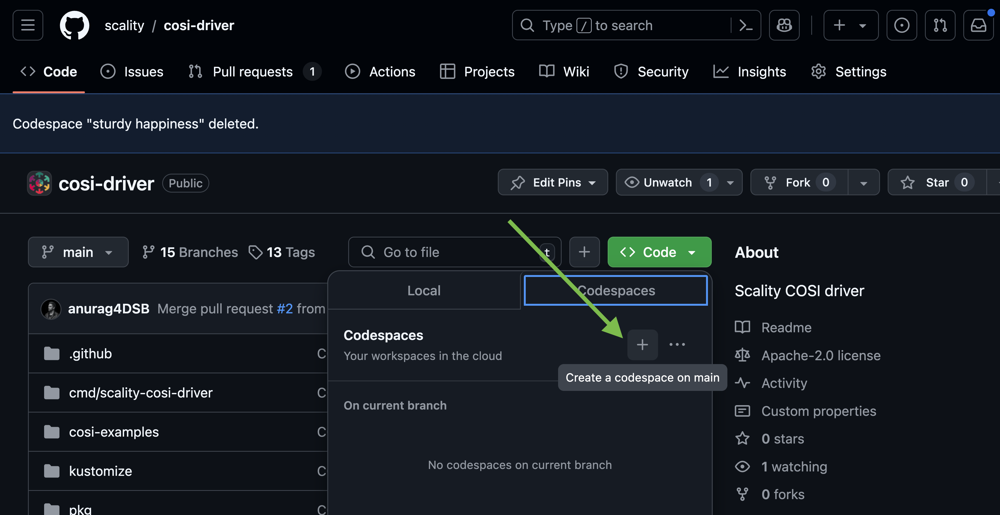

# Development Container Setup Guide

This guide explains how to set up and use the development environment using a Dev Container. The Dev Container provides a consistent and reproducible environment for development, testing, and building the Scality COSI Driver.

---

## Prerequisites

- **Visual Studio Code** with the **Remote - Containers** extension.
- **Docker** installed and running on your machine.

---

## What's Available in the Dev Container

The Dev Container comes pre-configured with the following tools and features:

- **Go**: The Go programming language environment.
- **Docker-in-Docker**: Allows running Docker commands inside the container.
- **AWS CLI**: For interacting with AWS services.
- **kubectl**, **Helm**: For Kubernetes development and testing.
- **Starts Minikube**: Initializes a local Kubernetes cluster.
- **Logs into GHCR**: Authenticates with GitHub Container Registry.
- **Prepares Directories**: Sets up logs and data directories for S3 and IAM services, `.github/e2e_tests`.
- **Deploys S3 and IAM Services**: Uses Docker Compose to start the required backend services.
- **Port Forwarding**: Ports `8000` and `8600` are forwarded for accessing services running inside the container.
- **Installs Testing Tools**: Ginkgo and Gomega for Go testing.
- **Cleans Up Docker Images**: Prunes unused Docker images to save space.

---

## Opening the Dev Container

### Use GitHub UI



### Open the Project in VS Code

1. Open Visual Studio Code.
2. Use the command palette (`Ctrl+Shift+P` or `Cmd+Shift+P`) and select **Remote-Containers: Open Folder in Container...**.
3. Navigate to and select the project folder (`cosi-driver/`).

VS Code will automatically detect the `.devcontainer/devcontainer.json` configuration and build the Dev Container. This may take a few minutes on the first run.

---

## Using the Dev Container

Once the Dev Container is up and running, you will have access to the pre-configured development environment.

There are 3 main scripts run in the CI:

- **.github/scripts/setup_cosi_resources.sh**: setups up COSI CRDs, COSI controller, COSI sidecar, and Scality COSI driver.
- **.github/scripts/e2e_test_bucket_creation.sh**: Sets up BucketClass, Bucket Claim, s3 secret(changed needed below), in kubernetes and tests create bucket using AWS CLI.
- **.github/scripts/cleanup_cosi_resources.sh**: Deletes all researources created in above two steps.

### Running Setup and Test Scripts

In the integrated terminal inside VS Code, run the following commands to set up resources, run end-to-end tests, and capture logs:

1. **Set Up COSI Resources**

    ```bash
    eval $(minikube docker-env)

    chmod +x .github/scripts/setup_cosi_resources.sh
    .github/scripts/setup_cosi_resources.sh
    ```

    This script performs the following:

    - Installs the COSI CRDs and Controller.
    - Builds and deploys the Scality COSI Driver.
    - Verifies that the driver pod is running.

2. **Run End-to-End Tests**

    ```bash
    eval $(minikube docker-env -u)

    chmod +x .github/scripts/e2e_test_bucket_creation.sh
    .github/scripts/e2e_test_bucket_creation.sh
    ```

    This script:

    - Creates an account in the IAM service.
    - Configures the AWS CLI with the account credentials.
    - Applies Kubernetes manifests for the `BucketClass` and `BucketClaim`.
    - Verifies that a bucket is created in the S3 service.

    This script captures logs from Kubernetes pods for debugging purposes and saves them to the `.github/e2e_tests/artifacts/logs/` directory.

#### Running Unit Tests

To run unit tests within the container, you can use Make to execute the Go unit tests.

- **Run Unit Tests**: In the VS code terminal execute `make test` or directly `ginkgo -r -v` from `/workspaces/cosi-driver` directory.

This command will run all the unit tests defined in your Go project, providing feedback directly in the terminal. The make test command is typically defined in a Makefile, and it runs tests using the Ginkgo GO testing testing framework.

---

## Tips for Using the Dev Container

- **Accessing Services**: The S3 service is accessible at `http://localhost:8000`, and the IAM service at `http://localhost:8600` from within the container.
- **Building the Project**: Use `make build` to compile the binary.
- **Running Unit Tests**: Use `make test` to run unit tests.
- **Developing**: Use VS Code's integrated features to write and debug code.
- **Kubernetes Dashboard**: Run `minikube start` to start dashboard for kubernetes.

---

## Troubleshooting

- **Dev Container Fails to Build**: Check the output in the VS Code terminal for error messages.
- **Permission Issues**: Ensure that scripts have executable permissions using `chmod +x`.
- **Minikube Issues**: Ensure virtualization is enabled on your machine and that Minikube can start.

---

## Cleaning Up

To clean up resources after development or testing:

1. **Stop S3 and IAM Services**
    To restart S3 an IAM resources containers execute `cd .github/s3_and_iam_deployment && docker compose --profile iam_s3 up -d`\

    ```bash
        eval $(minikube docker-env -u)

        docker compose -f .github/s3_and_iam_deployment/docker-compose.yml --profile iam_s3 down
    ```

2. **Delete Kubernetes Resources**

    ```bash
        eval $(minikube docker-env)

        chmod +x .github/scripts/cleanup_cosi_resources.sh
        .github/scripts/cleanup_cosi_resources.sh
    ```
